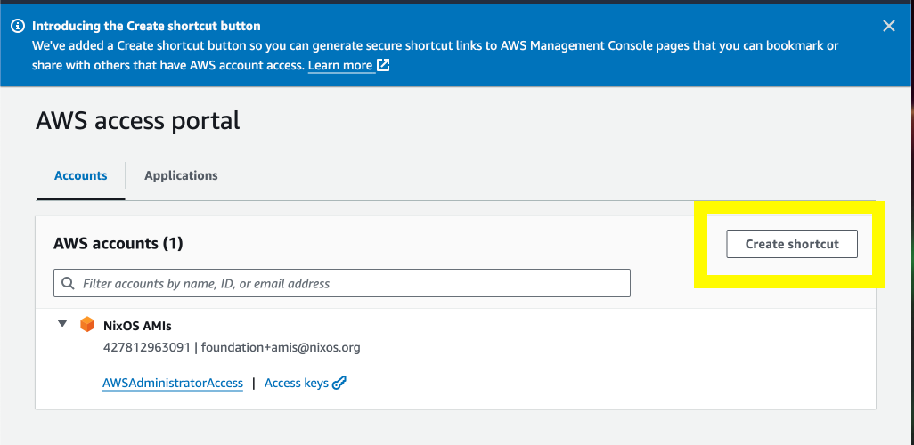
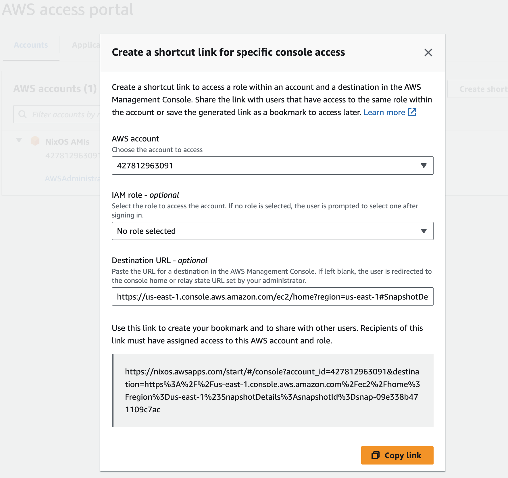

# Creating a bookmarklet to share links to AWS Console pages

## TL;DR

I created a bookmarklet that will generate a shortlink to the current AWS Console page you are on using
AWS' newly announced [Create shortcut link](https://docs.aws.amazon.com/singlesignon/latest/userguide/createshortcutlink.html?icmpid=docs_sso_console) support on the AWS IAM Identity Center Start Page.

The bookmarklet is generated by extracting data from an undocumented cookie `aws-userInfo` that contains the account ID and the Identity Center Portal URL.
I am not sure if this is a good idea, but it works for now!

If AWS is reading this, please just add a "Create Shortlink" button to every AWS Console page!

Drag the following links to your Bookmark bar to create a bookmarklet that will generate a shortlink to the current AWS Console page you are on.

* [Share shortcut][1]. Will create a link that tries to assume the same role as the person who created the link.
* [Share shortcut without role][2]. Strips off the role so that the user can select their own role to assume. (Useful if sharing page to less privileged person).

However if you want to know how this works, read on! Also you should probably not run
arbitrary bookmarklets without auditing them first to make sure I'm not stealing your credentials `:)`

## Details


AWS recommends using multiple accounts to separate different environments, such
as production, staging, and development. This is a good practice, but it is
cumbersome as you need  to switch between accounts frequently to manage and
debug resources.

A solution to this problem is using IAM Identity Center, which allows you  to
easily switch between accounts.

One problem  I've always had with AWS however, is that  it is not possible
to share links to AWS Console pages with colleagues. The AWS console page URL
does not contain the account ID, so the link is not valid for other users unless
they happen to be logged in to the same account.

E.g. the link
[https://us-east-1.console.aws.amazon.com/ec2/home?region=us-east-1#SnapshotDetails:snapshotId=snap-09e338b471109c7ac](https://us-east-1.console.aws.amazon.com/ec2/home?region=us-east-1#SnapshotDetails:snapshotId=snap-09e338b471109c7ac)
links to a snapshot that I own. But nothing in the URL tells you what account it is in, and thus
AWS redirects you to the generic  "Sign in to Console" page prompting for your Root IAM user credentials
or even worse it navigates to that page in a different account and says "Resource doesn't exist"

This is unlike GCP; where everything is in a single "Account", but things are segregated in "Projects". and the URL contains the project id.
This means when you share a link to the GCP console, people will be able to get exactly where you were.


## An improvement just landed

AWS Just announced the [Create shortcut button](https://docs.aws.amazon.com/singlesignon/latest/userguide/createshortcutlink.html?icmpid=docs_sso_console)
on the AWS IAM Identity Center Start Page.



You can then paste your Console URL into the screen and AWS will create a Shortcut that will include the account id and will redirect you
to AWS IAM Identity Center to sign in to the specific account automatically!


E.g. it generated the URL [https://nixos.awsapps.com/start/#/console?account_id=427812963091&destination=https%3A%2F%2Fus-east-1.console.aws.amazon.com%2Fec2%2Fhome%3Fregion%3Dus-east-1%23SnapshotDetails%3AsnapshotId%3Dsnap-09e338b471109c7ac](https://nixos.awsapps.com/start/#/console?account_id=427812963091&destination=https%3A%2F%2Fus-east-1.console.aws.amazon.com%2Fec2%2Fhome%3Fregion%3Dus-east-1%23SnapshotDetails%3AsnapshotId%3Dsnap-09e338b471109c7ac)
after me pasting in [https://us-east-1.console.aws.amazon.com/ec2/home?region=us-east-1#SnapshotDetails:snapshotId=snap-09e338b471109c7ac](https://us-east-1.console.aws.amazon.com/ec2/home?region=us-east-1#SnapshotDetails:snapshotId=snap-09e338b471109c7ac).

The new URL will prompt you to log in to my AWS account through SSO, and afterwards redirect you to the specific resource! Amazing!

<video controls width="884">
  <source src="assets/shorcut-demo.webm" type="video/webm" alt="Video demonstrating shortlinks">
  Your browser does not support the video tag.
</video>

## This is almost perfect ... but a button would be nicer

I need to go to the AWS IAM Identity Center portal, copy in the URL I just visited, and then copy out the URL to share with colleageus. 
This is cumbersome!

I wish AWS just adds a button "Create Shortlink" to every AWS Console page. But they don't have that yet so we have to hack something together ourselves!

Enter: bookmarklets.

> A bookmarklet is a bookmark stored in a web browser that contains JavaScript commands that add new features to the browser.

In order to form a shortlink we need a few components:

* the AWS Identity Center Portal URL
* The target Account ID
* The destination page we want to navigate to

Getting the destination is easy. `window.top.location.href` will do.
But how do we get the Portal URL and the account ID?
Looking through the JS source code of the Console I find that Telemetry code in AWS extracts
these bits of information from the cookie. And there is a cookie key named `aws-userInfo` that contains exactly the info we need!
```javascript
  function parseCookie(e, t = document.cookie) {
    const n = t.match(`${e}=([^;]*)`);
    if (n && n[1]) return n[1];
  }
  /* undocumented but this  is  how AWS  telemetry gets user info */
  const sessionData = JSON.parse(
    decodeURIComponent(parseCookie("aws-userInfo"))
  );
  console.log(sessionData);
```

```json
{
    "arn": "arn:aws:sts::427812963091:assumed-role/AWSReservedSSO_AWSAdministratorAccess_392b3f25267f6536/arianvp",
    "alias": "427812963091",
    "username": "assumed-role%2FAWSReservedSSO_AWSAdministratorAccess_392b3f25267f6536%2Farianvp",
    "keybase": " XXXX",
    "issuer": "https://nixos.awsapps.com/start/#/console?account_id=427812963091&role_name=AWSAdministratorAccess&destination=https%3A%2F%2Fconsole.aws.amazon.com",
    "signinType": "PUBLIC"
}
```

Putting all the bits together we can construct a share URL to the current open page  and copy it to the clipboard:
```javascript
(function (norole) {
  function parseCookie(e, t = document.cookie) {
    const n = t.match(`${e}=([^;]*)`);
    if (n && n[1]) return n[1];
  }
  /* undocumented but this  is  how AWS  telemetry gets user info */
  const sessionData = JSON.parse(
    decodeURIComponent(parseCookie("aws-userInfo"))
  );
  const issuer = new URL(sessionData.issuer);
  const hash = issuer.hash;
  const [front, params] = hash.split("?");
  const urlParams = new URLSearchParams(params);
  urlParams.set("destination", window.top.location.href);
  if (norole) { urlParams.delete("role_name"); };
  const newHash = `${front}?${urlParams.toString()}`;
  issuer.hash = newHash;
  const el = document.activeElement;
  navigator.clipboard.writeText(issuer.href);
  alert(`Copied ShortLink to clipboard`);
  el.focus();
})(false);
```

Encoding that into a URL gives us:

```javascript
console.log(`javascript:${encodeURIComponent(`(function (norole) {
  function parseCookie(e, t = document.cookie) {
    const n = t.match(\`\${e}=([^;]*)\`);
    if (n && n[1]) return n[1];
  }
  /* undocumented but this  is  how AWS  telemetry gets user info */
  const sessionData = JSON.parse(
    decodeURIComponent(parseCookie("aws-userInfo"))
  );
  const issuer = new URL(sessionData.issuer);
  const hash = issuer.hash;
  const [front, params] = hash.split("?");
  const urlParams = new URLSearchParams(params);
  if (norole) { urlParams.delete("role_name"); };
  urlParams.set("destination", window.top.location.href);
  const newHash = \`\${front}?\${urlParams.toString()}\`;
  issuer.hash = newHash;
  const el = document.activeElement;
  navigator.clipboard.writeText(issuer.href);
  alert(\`Copied ShortLink to clipboard\`);
  el.focus();
})(false);`)}`);
```
```
javascript:(function%20(norole)%20%7B%0A%20%20function%20parseCookie(e%2C%20t%20%3D%20document.cookie)%20%7B%0A%20%20%20%20const%20n%20%3D%20t.match(%60%24%7Be%7D%3D(%5B%5E%3B%5D*)%60)%3B%0A%20%20%20%20if%20(n%20%26%26%20n%5B1%5D)%20return%20n%5B1%5D%3B%0A%20%20%7D%0A%20%20%2F*%20undocumented%20but%20this%20%20is%20%20how%20AWS%20%20telemetry%20gets%20user%20info%20*%2F%0A%20%20const%20sessionData%20%3D%20JSON.parse(%0A%20%20%20%20decodeURIComponent(parseCookie(%22aws-userInfo%22))%0A%20%20)%3B%0A%20%20const%20issuer%20%3D%20new%20URL(sessionData.issuer)%3B%0A%20%20const%20hash%20%3D%20issuer.hash%3B%0A%20%20const%20%5Bfront%2C%20params%5D%20%3D%20hash.split(%22%3F%22)%3B%0A%20%20const%20urlParams%20%3D%20new%20URLSearchParams(params)%3B%0A%20%20if%20(norole)%20%7B%20urlParams.delete(%22role_name%22)%3B%20%7D%3B%0A%20%20urlParams.set(%22destination%22%2C%20window.top.location.href)%3B%0A%20%20const%20newHash%20%3D%20%60%24%7Bfront%7D%3F%24%7BurlParams.toString()%7D%60%3B%0A%20%20issuer.hash%20%3D%20newHash%3B%0A%20%20const%20el%20%3D%20document.activeElement%3B%0A%20%20navigator.clipboard.writeText(issuer.href)%3B%0A%20%20alert(%60Copied%20ShortLink%20to%20clipboard%60)%3B%0A%20%20el.focus()%3B%0A%7D)(false)%3B 
```

And we turn that into a bookmarklet URL. Try it now and drag it to your Bookmark bar!

* [Share shortcut][1]
* [Share shortcut without role][2]

<video controls width="884">
  <source src="assets/bookmarklet-demo.webm" type="video/webm" alt="Video demonstrating bookmarklet">
  Your browser does not support the video tag. 
</video>


[1]: javascript:(function%20(norole)%20%7B%0A%20%20function%20parseCookie(e%2C%20t%20%3D%20document.cookie)%20%7B%0A%20%20%20%20const%20n%20%3D%20t.match(%60%24%7Be%7D%3D(%5B%5E%3B%5D*)%60)%3B%0A%20%20%20%20if%20(n%20%26%26%20n%5B1%5D)%20return%20n%5B1%5D%3B%0A%20%20%7D%0A%20%20%2F*%20undocumented%20but%20this%20%20is%20%20how%20AWS%20%20telemetry%20gets%20user%20info%20*%2F%0A%20%20const%20sessionData%20%3D%20JSON.parse(%0A%20%20%20%20decodeURIComponent(parseCookie(%22aws-userInfo%22))%0A%20%20)%3B%0A%20%20const%20issuer%20%3D%20new%20URL(sessionData.issuer)%3B%0A%20%20const%20hash%20%3D%20issuer.hash%3B%0A%20%20const%20%5Bfront%2C%20params%5D%20%3D%20hash.split(%22%3F%22)%3B%0A%20%20const%20urlParams%20%3D%20new%20URLSearchParams(params)%3B%0A%20%20if%20(norole)%20%7B%20urlParams.delete(%22role_name%22)%3B%20%7D%3B%0A%20%20urlParams.set(%22destination%22%2C%20window.top.location.href)%3B%0A%20%20const%20newHash%20%3D%20%60%24%7Bfront%7D%3F%24%7BurlParams.toString()%7D%60%3B%0A%20%20issuer.hash%20%3D%20newHash%3B%0A%20%20const%20el%20%3D%20document.activeElement%3B%0A%20%20navigator.clipboard.writeText(issuer.href)%3B%0A%20%20alert(%60Copied%20ShortLink%20to%20clipboard%60)%3B%0A%20%20el.focus()%3B%0A%7D)(false)%3B 
[2]: javascript:(function%20(norole)%20%7B%0A%20%20function%20parseCookie(e%2C%20t%20%3D%20document.cookie)%20%7B%0A%20%20%20%20const%20n%20%3D%20t.match(%60%24%7Be%7D%3D(%5B%5E%3B%5D*)%60)%3B%0A%20%20%20%20if%20(n%20%26%26%20n%5B1%5D)%20return%20n%5B1%5D%3B%0A%20%20%7D%0A%20%20%2F*%20undocumented%20but%20this%20%20is%20%20how%20AWS%20%20telemetry%20gets%20user%20info%20*%2F%0A%20%20const%20sessionData%20%3D%20JSON.parse(%0A%20%20%20%20decodeURIComponent(parseCookie(%22aws-userInfo%22))%0A%20%20)%3B%0A%20%20const%20issuer%20%3D%20new%20URL(sessionData.issuer)%3B%0A%20%20const%20hash%20%3D%20issuer.hash%3B%0A%20%20const%20%5Bfront%2C%20params%5D%20%3D%20hash.split(%22%3F%22)%3B%0A%20%20const%20urlParams%20%3D%20new%20URLSearchParams(params)%3B%0A%20%20if%20(norole)%20%7B%20urlParams.delete(%22role_name%22)%3B%20%7D%3B%0A%20%20urlParams.set(%22destination%22%2C%20window.top.location.href)%3B%0A%20%20const%20newHash%20%3D%20%60%24%7Bfront%7D%3F%24%7BurlParams.toString()%7D%60%3B%0A%20%20issuer.hash%20%3D%20newHash%3B%0A%20%20const%20el%20%3D%20document.activeElement%3B%0A%20%20navigator.clipboard.writeText(issuer.href)%3B%0A%20%20alert(%60Copied%20ShortLink%20to%20clipboard%60)%3B%0A%20%20el.focus()%3B%0A%7D)(true)%3B

## Conclusion

I hope this bookmarklet will help you share AWS Console pages with your colleagues more easily.
This is using an undocumented cookie, so it might break at any time. 
I hope AWS will add a "Create Shortcut" button to every AWS Console page soon!